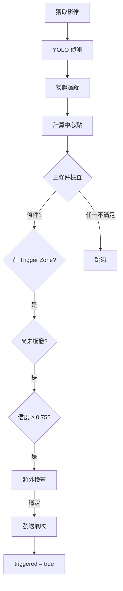

# Two-Band Filter 觸發系統

> 用於 PET 瓶傳帶分選的 ROI 中心觸發邏輯

## 📋 系統概述

Two-Band Filter 是一個智能觸發系統，透過將相機視野分為三個區域（Entry Zone、Trigger Zone、Exit Zone），確保每個物體只在最佳位置觸發一次氣吹，提高分選精度和效率。

### 主要特點

- ✅ **單次觸發**: 同一物體只觸發一次氣吹，避免浪費
- ✅ **高精度**: 只在畸變最小的中央區域觸發
- ✅ **穩定性檢測**: 自動檢測中心點飄移和信度波動
- ✅ **超時處理**: ACK 超時自動標記為未處理
- ✅ **統計監控**: 完整的性能統計和監控指標

## 🏗️ 系統架構

```
two_band_filter.py          # 主控類
├── track_manager.py         # 追蹤狀態管理器
├── blow_controller.py       # 氣吹控制器
└── tcp_server.py           # TCP 通訊（已存在）
```

## 📐 視野分區

```
┌─────────────────────────────────┐  Y = 0
│         ENTRY ZONE              │  開始追蹤
│     (Y < IMAGE_H × 0.375)       │  分配 ID
├─────────────────────────────────┤  Y = IMAGE_H × 0.375
│        TRIGGER ZONE             │  ★ 唯一觸發區域
│  (IMAGE_H × 0.375 ~ 0.625)      │  影像最清晰
├─────────────────────────────────┤  Y = IMAGE_H × 0.625
│         EXIT ZONE               │  清除追蹤
│     (Y > IMAGE_H × 0.625)       │
└─────────────────────────────────┘  Y = IMAGE_H
```

## 🚀 快速開始

### 1. 安裝依賴

```bash
pip install numpy opencv-python
```

### 2. 初始化系統

```python
from two_band_filter import TwoBandFilter
from tcp_server import get_tcp_server

# 啟動 TCP 伺服器
start_tcp_server(host='localhost', port=8888)
tcp_server = get_tcp_server()

# 初始化 Two-Band Filter
filter_system = TwoBandFilter(
    image_width=1280,
    image_height=1024,
    lens_type="12mm",           # 或 "8mm"
    confidence_threshold=0.75,
    tracking_timeout_frames=15,
    tcp_server=tcp_server
)
```

### 3. 處理每一帧

```python
# 在相機取圖迴圈中
while True:
    # 1. 獲取影像
    frame = camera.get_frame()
    
    # 2. YOLO 偵測
    detections = yolo_model(frame)
    
    # 3. 物體追蹤
    tracker_results = tracker.update(detections)
    
    # 4. Two-Band Filter 處理
    result = filter_system.process_frame(detections, tracker_results)
    
    # 5. 視覺化（可選）
    vis_frame = filter_system.visualize_zones(frame)
    vis_frame = filter_system.draw_tracks(vis_frame, tracker_results)
    cv2.imshow("Two-Band Filter", vis_frame)
```

### 4. 查看統計

```python
# 程式結束時
filter_system.print_statistics()
```

## 📊 參數配置

### 區域邊界

| 參數 | 預設值 | 說明 |
|------|--------|------|
| Entry Zone 下邊界 | IMAGE_H × 0.375 | 開始追蹤的區域 |
| Trigger Zone | IMAGE_H × 0.375 ~ 0.625 | 唯一觸發區域（中央 25%） |
| Exit Zone 上邊界 | IMAGE_H × 0.625 | 清除追蹤的區域 |

### 鏡頭參數

| 參數 | 12mm 鏡頭 | 8mm 鏡頭 |
|------|-----------|----------|
| 中心點水平容差 | ±5 pixels | ±8 pixels |

### 偵測參數

| 參數 | 預設值 | 說明 |
|------|--------|------|
| 信度閾值 | 0.75 | 類別信度必須 ≥ 此值才觸發 |
| 追蹤超時 | 15 帧 | 連續未偵測到的最大帧數 |
| 氣吹延遲 | 80~120 ms | 指令發出到實際噴氣的延遲 |
| ACK 超時 | 200 ms | 等待 ACK 的最大時間 |

## 🔄 觸發流程



## 📝 追蹤器結果格式

Two-Band Filter 接受以下格式的追蹤器結果：

```python
tracker_results = [
    (track_id, [x1, y1, x2, y2, confidence, class_id]),
    (track_id, [x1, y1, x2, y2, confidence, class_id]),
    ...
]
```

或簡化格式（會自動從 detections 中查找信度和類別）：

```python
tracker_results = [
    (track_id, [x1, y1, x2, y2]),
    (track_id, [x1, y1, x2, y2]),
    ...
]
```

## 🔧 整合到現有系統

### 修改 CamOperation_class.py

在 `CamOperation_class.py` 的 `Work_thread` 函數中添加以下代碼：

```python
# 1. 在文件頂部添加 import
from two_band_filter import TwoBandFilter
from tcp_server import get_tcp_server

# 2. 初始化（在 __init__ 或 Start_grabbing 中）
self.two_band_filter = TwoBandFilter(
    image_width=image_width,
    image_height=image_height,
    lens_type="12mm",
    tcp_server=get_tcp_server()
)

# 3. 在取得 YOLO 結果後
if ai_model is not None:
    results = ai_model(image_array)
    
    # 需要添加追蹤器（ByteTrack 或 DeepSORT）
    # tracker_results = tracker.update(results)
    
    # 使用 Two-Band Filter
    filter_result = self.two_band_filter.process_frame(
        detections=results,
        tracker_results=tracker_results
    )
```

## ⚠️ 異常處理

系統自動處理以下異常情況：

1. **中心點飄移**: 超過 2× 容差時暫停觸發
2. **信度不足**: 跳過該帧繼續等待
3. **物體消失**: 重新出現視為新物體
4. **ACK 超時**: 標記為未處理，記錄到失敗列表

## 📈 性能監控

### 建議監控的指標

| 指標 | 警戒閾值 | 說明 |
|------|----------|------|
| 觸發成功率 | < 95% | 成功收到 ACK / 總觸發數 |
| 重複觸發率 | > 0% | 同一 Track ID 觸發次數 > 1 |
| 追蹤丟失率 | > 10% | 超時清除 / 正常 Exit |
| 平均信度 | < 0.85 | 觸發時的平均信度 |

### 查看統計

```python
# 獲取統計資料
stats = filter_system.get_statistics()
print(f"Total triggers: {stats['trigger_count']}")
print(f"Success rate: {stats['blow_stats']['success_rate']:.1f}%")

# 或直接列印
filter_system.print_statistics()
```

## 🧪 測試

運行範例程式：

```bash
# 1. 視覺化區域
python example_two_band_filter.py
# 選擇 1

# 2. 模擬測試
python example_two_band_filter.py
# 選擇 2

# 3. 查看整合代碼
python example_two_band_filter.py
# 選擇 3
```

## 📚 API 文檔

### TwoBandFilter 類

#### `__init__(image_width, image_height, lens_type, confidence_threshold, tracking_timeout_frames, tcp_server)`

初始化 Two-Band Filter

#### `process_frame(detections, tracker_results)`

處理單帧，返回處理結果字典

**Returns:**
```python
{
    'frame_count': int,
    'active_tracks': int,
    'triggered_tracks': int,
    'triggered_this_frame': [
        {
            'track_id': int,
            'cx': float,
            'cy': float,
            'class_id': int,
            'confidence': float
        }
    ],
    'timeout_blows': [str]  # 超時的 blow_id 列表
}
```

#### `visualize_zones(image)`

在圖像上繪製區域邊界

#### `draw_tracks(image, tracker_results)`

在圖像上繪製追蹤結果

#### `get_statistics()`

獲取統計資訊

#### `print_statistics()`

列印統計資訊

## 🔗 相關文件

- `claude.md` - 完整的設計文檔
- `CamOperation_class.py` - 相機操作類
- `tcp_server.py` - TCP 通訊伺服器
- `example_two_band_filter.py` - 使用範例

## 📝 版本歷史

| 版本 | 日期 | 說明 |
|------|------|------|
| v1.0 | 2026-02-03 | 初始版本 |

## 👥 作者

NIRcam 開發團隊

## 📄 授權

內部專案使用
