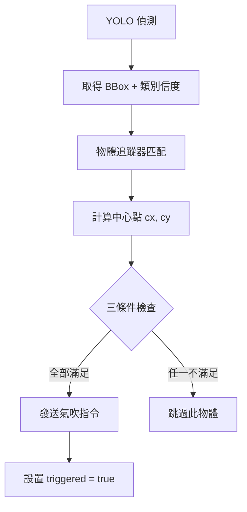

# NIRcam 氣吹觸發策略文檔

## 📋 系統概述

本系統用於 PET 瓶傳帶分選，透過 NIR 相機進行即時偵測與分類，並在正確時機發送氣吹指令將目標物體吹離傳帶。

### 運行環境
- **傳帶線速**: 1.8～2.0 m/s
- **相機模式**: 持續拍攝
- **主要挑戰**: 
  1. 同一物體在視野中會被多帧反覆偵測，造成重複噴氣浪費
  2. 視野邊緣因畸變和定位誤差大，觸發精度低

---

## 🎯 Two-Band Filter 觸發邏輯

### 設計目的
Two-Band Filter 透過將視野分區，確保：
1. **單次觸發**: 同一物體只觸發一次氣吹
2. **高精度觸發**: 只在畸變最小的中央區域觸發

---

## 📐 視野分區設計

將相機視野沿 **Y 軸**（垂直方向，0 在圖像頂端）分為三個帶狀區域：

```
┌─────────────────────────────────┐  Y = 0 (圖像頂端)
│                                 │
│         ENTRY ZONE              │  物體進入視野
│     (Y < IMAGE_H × 0.375)       │  開始追蹤、分配 ID
│                                 │
├─────────────────────────────────┤  Y = IMAGE_H × 0.375
│                                 │
│        TRIGGER ZONE             │  ★ 唯一允許觸發區域
│  (IMAGE_H × 0.375 ~ 0.625)      │  影像最清晰、畸變最小
│        佔視野中央 25%           │
│                                 │
├─────────────────────────────────┤  Y = IMAGE_H × 0.625
│                                 │
│         EXIT ZONE               │  物體離開視野
│     (Y > IMAGE_H × 0.625)       │  清除追蹤狀態
│                                 │
└─────────────────────────────────┘  Y = IMAGE_H (圖像底端)

        物體移動方向: ↓ (從上往下)
```

### 區域功能說明

| 區域 | Y 範圍 | 功能 |
|------|--------|------|
| **Entry Zone** | Y < IMAGE_H × 0.375 | 物體進入視野，開始偵測與追蹤，分配 Track ID |
| **Trigger Zone** | IMAGE_H × 0.375 ≤ Y ≤ IMAGE_H × 0.625 | **唯一觸發區域**，影像品質最佳 |
| **Exit Zone** | Y > IMAGE_H × 0.625 | 清除追蹤狀態（中心點進入此區或連續 15 帧失蹤） |

---

## ⚡ 觸發機制流程

### 每帧處理流程



### 觸發三條件（必須同時滿足）

```python
def should_trigger(track_id, cx, cy, confidence, track_state):
    """
    判斷是否應該觸發氣吹
    
    Parameters:
        track_id: 追蹤 ID
        cx, cy: 物體中心點座標
        confidence: 類別信度
        track_state: 追蹤狀態字典
    
    Returns:
        bool: 是否觸發
    """
    # 條件 1: 中心點在 Trigger Zone 內
    trigger_zone_top = IMAGE_H * 0.375
    trigger_zone_bottom = IMAGE_H * 0.625
    in_trigger_zone = trigger_zone_top <= cy <= trigger_zone_bottom
    
    # 條件 2: 該追蹤 ID 尚未觸發過
    not_triggered_yet = not track_state[track_id].triggered
    
    # 條件 3: 類別信度達標
    confidence_ok = confidence >= 0.75
    
    return in_trigger_zone and not_triggered_yet and confidence_ok
```

---

## 📊 關鍵參數配置

### 區域邊界參數

```python
# 視野分區配置
ENTRY_ZONE_RATIO = 0.375      # Entry Zone 下邊界
TRIGGER_ZONE_TOP = 0.375      # Trigger Zone 上邊界
TRIGGER_ZONE_BOTTOM = 0.625   # Trigger Zone 下邊界
EXIT_ZONE_RATIO = 0.625       # Exit Zone 上邊界
```

### 鏡頭相關參數

| 參數 | 12mm 鏡頭 | 8mm 鏡頭 |
|------|-----------|----------|
| 中心點水平容差 | ±5 pixels | ±8 pixels |

### 追蹤與偵測參數

```python
# 偵測閾值
CONFIDENCE_THRESHOLD = 0.75   # 類別信度閾值

# 追蹤參數
TRACKING_TIMEOUT_FRAMES = 15  # 連續失蹤帧數上限

# 氣吹延遲
BLOW_DELAY_MS = (80, 120)     # 指令發出到實際噴氣的延遲範圍 (ms)
```

---

## 🔧 追蹤狀態管理

### 追蹤狀態結構

```python
from dataclasses import dataclass, field
from typing import List, Tuple

@dataclass
class TrackState:
    """單一物體的追蹤狀態"""
    track_id: int                           # 追蹤 ID
    triggered: bool = False                 # 是否已觸發氣吹
    missing_frames: int = 0                 # 連續未偵測到的帧數
    last_center: Tuple[float, float] = None # 上一帧的中心點
    center_history: List[Tuple[float, float]] = field(default_factory=list)  # 最近 3 帧中心點歷史
    confidence_history: List[float] = field(default_factory=list)            # 信度歷史

class TrackManager:
    """追蹤狀態管理器"""
    
    def __init__(self, lens_type: str = "12mm"):
        self.tracks = {}  # track_id -> TrackState
        self.lens_type = lens_type
        
        # 根據鏡頭類型設置容差
        self.center_tolerance = 5 if lens_type == "12mm" else 8
    
    def update_track(self, track_id: int, cx: float, cy: float, confidence: float):
        """更新追蹤狀態"""
        if track_id not in self.tracks:
            self.tracks[track_id] = TrackState(track_id=track_id)
        
        state = self.tracks[track_id]
        state.missing_frames = 0
        state.last_center = (cx, cy)
        
        # 維護最近 3 帧的歷史
        state.center_history.append((cx, cy))
        if len(state.center_history) > 3:
            state.center_history.pop(0)
        
        state.confidence_history.append(confidence)
        if len(state.confidence_history) > 3:
            state.confidence_history.pop(0)
    
    def mark_missing(self, track_id: int):
        """標記物體在當前帧未被偵測到"""
        if track_id in self.tracks:
            self.tracks[track_id].missing_frames += 1
    
    def should_remove(self, track_id: int, cy: float) -> bool:
        """判斷是否應該移除追蹤"""
        if track_id not in self.tracks:
            return False
        
        state = self.tracks[track_id]
        
        # 條件 1: 進入 Exit Zone
        in_exit_zone = cy > IMAGE_H * 0.625
        
        # 條件 2: 連續超過 15 帧未偵測到
        timeout = state.missing_frames > 15
        
        return in_exit_zone or timeout
    
    def remove_track(self, track_id: int):
        """移除追蹤狀態"""
        if track_id in self.tracks:
            del self.tracks[track_id]
```

---

## ⚠️ 異常處理機制

### 1. 中心點飄移檢測

```python
def check_center_drift(self, track_id: int) -> bool:
    """
    檢查中心點是否在連續 3 帧內飄移過大
    
    Returns:
        bool: True 表示穩定，可以觸發；False 表示飄移過大，暫停觸發
    """
    state = self.tracks.get(track_id)
    if not state or len(state.center_history) < 3:
        return True  # 歷史不足，假設穩定
    
    # 計算連續帧之間的位移
    drift_threshold = self.center_tolerance * 2  # 容差的兩倍
    
    for i in range(1, len(state.center_history)):
        prev = state.center_history[i-1]
        curr = state.center_history[i]
        drift = ((curr[0] - prev[0])**2 + (curr[1] - prev[1])**2) ** 0.5
        
        if drift > drift_threshold:
            return False  # 飄移過大
    
    return True
```

### 2. 信度波動處理

```python
def check_confidence_stable(self, track_id: int, current_confidence: float) -> bool:
    """
    檢查信度是否穩定
    如果信度在閾值附近反覆波動，跳過該帧但不清除追蹤
    
    Returns:
        bool: True 表示可以觸發；False 表示應跳過該帧
    """
    # 當前帧信度未達標
    if current_confidence < CONFIDENCE_THRESHOLD:
        return False
    
    state = self.tracks.get(track_id)
    if not state or len(state.confidence_history) < 2:
        return True
    
    # 檢查是否有劇烈波動（上一帧低於閾值，這一帧高於）
    prev_conf = state.confidence_history[-2] if len(state.confidence_history) >= 2 else current_confidence
    
    # 如果前一帧低於閾值，等待一帧確認穩定
    if prev_conf < CONFIDENCE_THRESHOLD:
        return False
    
    return True
```

### 3. 物體重現處理

```python
def handle_reappear(self, detection_result, existing_tracks):
    """
    處理物體突然消失後又重新出現的情況
    視為新物體，重新分配 ID
    
    NOTE: 此邏輯由追蹤器（如 ByteTrack、DeepSORT）自動處理
    當物體超時後追蹤被清除，重新出現時會分配新 ID
    """
    pass  # 由追蹤器內部處理
```

### 4. 氣吹 ACK 超時處理

```python
import logging
from datetime import datetime

class BlowController:
    """氣吹控制器"""
    
    def __init__(self, ack_timeout_ms: int = 200):
        self.ack_timeout_ms = ack_timeout_ms
        self.pending_blows = {}  # blow_id -> (timestamp, track_info)
        self.failed_blows = []   # 未收到 ACK 的氣吹記錄
        self.logger = logging.getLogger("BlowController")
    
    def send_blow_command(self, cx: float, cy: float, class_label: str, track_id: int):
        """
        發送氣吹指令
        
        Parameters:
            cx, cy: 中心點座標
            class_label: 類別標記
            track_id: 追蹤 ID
        """
        blow_id = self._generate_blow_id()
        command = {
            "blow_id": blow_id,
            "cx": cx,
            "cy": cy,
            "class": class_label,
            "track_id": track_id,
            "timestamp": datetime.now()
        }
        
        self._send_to_controller(command)
        self.pending_blows[blow_id] = (datetime.now(), command)
        
        self.logger.info(f"Sent blow command: {blow_id} for track {track_id}")
    
    def receive_ack(self, blow_id: str):
        """接收氣吹控制器的 ACK"""
        if blow_id in self.pending_blows:
            del self.pending_blows[blow_id]
            self.logger.info(f"Received ACK for blow: {blow_id}")
    
    def check_timeouts(self):
        """
        檢查超時的氣吹指令
        超時未收到 ACK 的記錄為未處理，交由後端人工分選
        """
        current_time = datetime.now()
        timeout_ids = []
        
        for blow_id, (timestamp, command) in self.pending_blows.items():
            elapsed_ms = (current_time - timestamp).total_seconds() * 1000
            if elapsed_ms > self.ack_timeout_ms:
                timeout_ids.append(blow_id)
                self.failed_blows.append({
                    "blow_id": blow_id,
                    "command": command,
                    "reason": "ACK_TIMEOUT",
                    "timestamp": current_time
                })
                self.logger.warning(f"Blow command timeout: {blow_id}, sending to manual sorting")
        
        for blow_id in timeout_ids:
            del self.pending_blows[blow_id]
        
        return timeout_ids
```

---

## 🔄 完整處理流程示例

```python
class TwoBandFilter:
    """Two-Band Filter 主控類"""
    
    def __init__(self, image_height: int, lens_type: str = "12mm"):
        self.IMAGE_H = image_height
        self.track_manager = TrackManager(lens_type=lens_type)
        self.blow_controller = BlowController()
        
        # 區域邊界
        self.trigger_zone_top = self.IMAGE_H * 0.375
        self.trigger_zone_bottom = self.IMAGE_H * 0.625
    
    def process_frame(self, detections, tracker_results):
        """
        處理單帧
        
        Parameters:
            detections: YOLO 偵測結果 [(bbox, class_id, confidence), ...]
            tracker_results: 追蹤器結果 [(track_id, bbox), ...]
        """
        # 1. 更新所有追蹤狀態
        current_track_ids = set()
        
        for track_id, bbox in tracker_results:
            current_track_ids.add(track_id)
            
            # 計算中心點
            cx = (bbox[0] + bbox[2]) / 2
            cy = (bbox[1] + bbox[3]) / 2
            
            # 找到對應的信度
            confidence = self._find_confidence(bbox, detections)
            
            # 更新追蹤狀態
            self.track_manager.update_track(track_id, cx, cy, confidence)
            
            # 檢查是否應該移除（進入 Exit Zone）
            if self.track_manager.should_remove(track_id, cy):
                self.track_manager.remove_track(track_id)
                continue
            
            # 檢查觸發條件
            if self._should_trigger(track_id, cx, cy, confidence):
                class_label = self._get_class_label(bbox, detections)
                self.blow_controller.send_blow_command(cx, cy, class_label, track_id)
                self.track_manager.tracks[track_id].triggered = True
        
        # 2. 標記未在當前帧出現的追蹤為 missing
        for track_id in list(self.track_manager.tracks.keys()):
            if track_id not in current_track_ids:
                self.track_manager.mark_missing(track_id)
                
                # 檢查是否超時
                if self.track_manager.tracks[track_id].missing_frames > 15:
                    self.track_manager.remove_track(track_id)
        
        # 3. 檢查氣吹超時
        self.blow_controller.check_timeouts()
    
    def _should_trigger(self, track_id: int, cx: float, cy: float, confidence: float) -> bool:
        """綜合判斷是否應該觸發"""
        state = self.track_manager.tracks.get(track_id)
        if not state:
            return False
        
        # 條件 1: 在 Trigger Zone 內
        in_zone = self.trigger_zone_top <= cy <= self.trigger_zone_bottom
        if not in_zone:
            return False
        
        # 條件 2: 尚未觸發
        if state.triggered:
            return False
        
        # 條件 3: 信度達標
        if confidence < CONFIDENCE_THRESHOLD:
            return False
        
        # 額外檢查: 中心點穩定性
        if not self.track_manager.check_center_drift(track_id):
            return False
        
        # 額外檢查: 信度穩定性
        if not self.track_manager.check_confidence_stable(track_id, confidence):
            return False
        
        return True
```

---

## 📈 性能監控指標

### 建議監控的指標

| 指標 | 說明 | 警戒閾值 |
|------|------|----------|
| 觸發成功率 | 成功收到 ACK / 總觸發數 | < 95% |
| 重複觸發率 | 同一 Track ID 觸發次數 > 1 | > 0% |
| 追蹤丟失率 | 超時清除 / 正常 Exit | > 10% |
| 平均信度 | 觸發時的平均信度 | < 0.85 |
| 中心點飄移次數 | 因飄移暫停觸發的次數 | 持續上升 |

---

## 📝 變更日誌

| 日期 | 版本 | 變更內容 |
|------|------|----------|
| 2026-02-03 | v1.0 | 初始版本：Two-Band Filter 觸發邏輯文檔 |

---

## 🔗 相關文件

- `CamOperation_class.py` - 相機操作類
- `TriggerDetect.py` - 觸發偵測模組
- `tcp_server.py` - TCP 通訊伺服器
